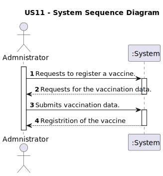
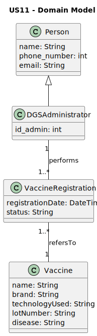
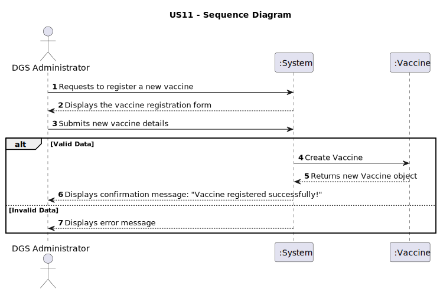
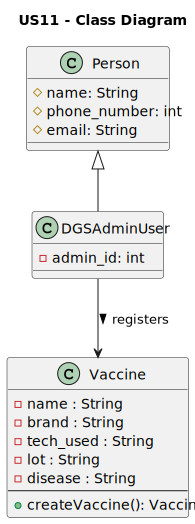

# US11 - Register a vaccine

## 1. Requeriments Engineering

### 1.1. User Story Description

Insert here the User Story as described by the client._

### 1.2. Customer Specifications and Clarifications

Vaccine: The client specifies that a vaccine must be identified by its Code (unique), Brand Name, Type (e.g., mRNA, viral vector, protein subunit), Manufacturer, and Number of Doses required for the complete schedule.

Registration: The registration must be a guided process that ensures the integrity of the essential vaccine data._

### 1.3. Acceptance Criteria

__AC1:__ The Administrator must have access to a form where they can input all the necessary vaccine data (Code, Brand Name, Type, Manufacturer, Number of Doses).

__AC2:__ All fields are mandatory.

__AC3:__ The system must validate that the Vaccine Code is unique before finalizing the registration. If the code already exists, an appropriate error message must be displayed.

__AC4:__ Upon successful submission, the system must persist the new vaccine data and present a confirmation message to the Administrator.

__AC5:__ The Number of Doses field must only accept positive integer values (e.g., 1, 2, 3).

__AC6:__ The Vaccine Type must be selected from a predefined list of available technologies. (Reference: https://www.pfizer.com/news/articles/understanding_six_types_of_vaccine_technologies).

### 1.4. Found out Dependencies

__US11- As Administrator, I want to register an employee:__ This US11 is dependent on the type of vaccine via US10.

### 1.5 Input and Output Data

__Input Data:__

* Name: String
* Brand Name: String
* Techonology Used: String
* Lot Number: String
* Disaese: String

__Output Data:__

* Sucess: Confirmation message of the creation of thr vaccine

### 1.6. System Sequence Diagram (SSD)

The SSD illustrates the interaction between the Actor (Administrator) and the System (:System).

### 1.7 Other Relevant Remarks

_Use this section to capture other relevant information that is related with this US such as:
&nbsp; &nbsp; (i) special requirements;
&nbsp; &nbsp; (ii) data and/or technology variations;
&nbsp; &nbsp; (iii) how often this US is held._

## 2. Analysis

### 2.1. Relevant Domain Model Excerpt

This Domain Model displays the business concepts relevant to this US. The model utilizes shows the different employee roles as specializations of Person.

### 2.2. Other Remarks

_Use this section to capture some additional notes/remarks that must be taken into consideration in the design activity. In some cases, it might be useful to add other analysis artifacts (e.g. activity or state diagrams)._

## 3. Design - User Story Realization

### 3.1. Rationale

**The rationale grounds on the SSD interactions and the identified input/output data.**

| Interaction ID | Question: Which class is responsible for... | Answer | Justification (with patterns) |
| :------------- | :------------------------------------------ | :----- | :---------------------------- |
| Step 1         | Interacting with the Admin                  |        |                               |
| Step 2         |                                             |        |                               |
| Step 3         |                                             |        |                               |
| Step 4         |                                             |        |                               |
| Step 5         |                                             |        |                               |
| ...            | ...                                         | ...    | ...                           |
| ...            | ...                                         | ...    | ...                           |

### Systematization

According to the taken rationale, the conceptual classes promoted to software classes are:

- Class1
- Class2
- Class3

Other software classes (i.e. Pure Fabrication) identified:

- xxxxView
- xxxxController

### 3.2. Sequence Diagram (SD)

_In this section, it is suggested to present an UML dynamic view representing the sequence of interactions between software objects that allows to fulfill the requirements._

### 3.3. Class Diagram (CD)

_In this section, it is suggested to present an UML static view representing the main related software classes that are involved in fulfilling the requirements as well as their relations, attributes and methods._

## 4. Tests

_In this section, it is suggested to systematize how the tests were designed to allow a correct measurement of requirements fulfilling._

**_DO NOT COPY ALL DEVELOPED TESTS HERE_**

**Test 1:** Check that it is not possible to create an instance of the Example class with empty values.

class ExampleFixture : public ::testing::Test {
TEST_F(ExampleFixture, CreateWithEmptyCode){
EXPECT_THROW(new Example(L"",L"Example One"),std::invalid_argument);
}
}
_It is also recommended organizing this content by subsections._

## 5. Construction (Implementation)

_In this section, it is suggested to provide, if necessary, some evidence that the construction/implementation is in accordance with the previously carried out design. Furthermore, it is recommended to mention/describe the existence of other relevant files (e.g. configuration) and highlight relevant commits._

_It is also recommended to organize this content by subsections._

## 6. Integration and Demo

_In this section, it is suggested to describe the efforts made to integrate this functionality with the other features of the system._

## 7. Observations

_In this section, it is suggested to present a critical perspective on the developed work, pointing, for example, to other alternatives and or future related work._
