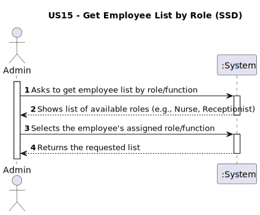
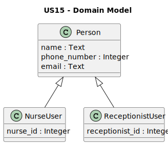
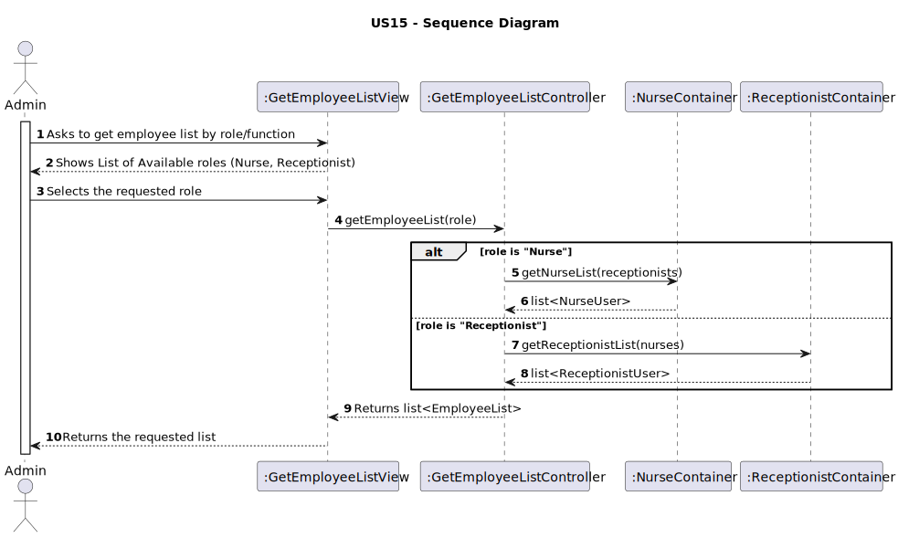
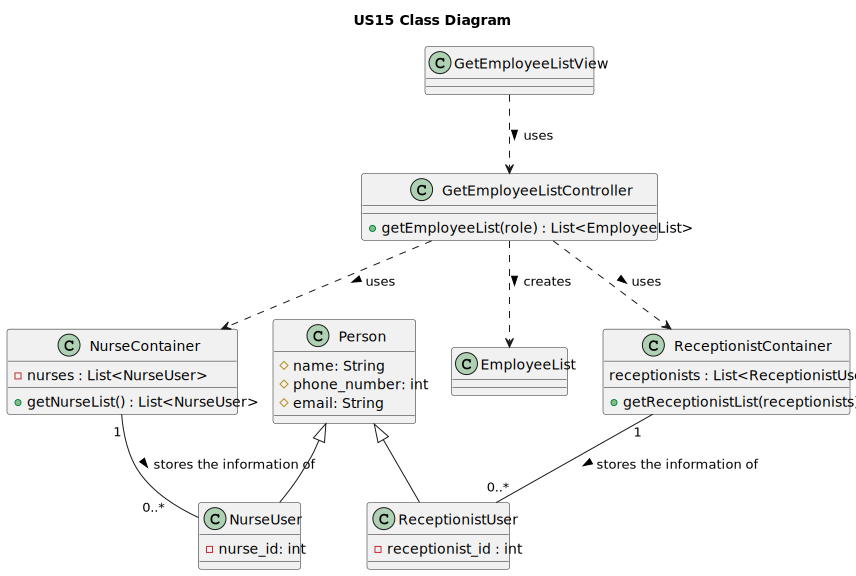

# US15 - Get a list of employees assigned to a specific function/role.

## 1. Requirements Engineering

### 1.1. User Story Description

As an administrator, I want to get a list of employees assigned to a specific function/role.

### 1.2. Customer Specifications and Clarifications

Based on the analysis of the client requirements, the following interpretations were established:

__Employee :__ This refers to the staff involved in all the process of vaccination. The client explicity identifies "Receptionists" and "Nurses" as personal working at the vaccination centers.

### 1.3. Acceptance Criteria

__AC1:__ The Administrator must first select the function/role (e.g., "Nurse", "Receptionist") from a list of available roles provided by the system.

__AC2:__ Upon selection, the system must present a list of all employees registered with that specific function/role.

### 1.4. Found out Dependencies

__US14 - As Administrator, I want to register an employee:__ This US15 is dependent on the existence of employees registered via [US14](../US14/US14.md). The way each role is handled at US14 has a direct impact on how it's established here.

### 1.5 Input and Output Data

__Input Data :__

Selected data: 

- The Administrator selects a Function/Role.

__Output Data:__

- The system presents the list of available roles.

- The system presents the list of employees corresponding to the selected role.

### 1.6. System Sequence Diagram (SSD)

The SSD illustrates the interaction between the Actor (Administrator) and the System (:System).

### 1.7 Other Relevant Remarks

_Use this section to capture other relevant information that is related with this US such as:  
&nbsp; &nbsp; (i) special requirements;  
&nbsp; &nbsp; (ii) data and/or technology variations;  
&nbsp; &nbsp; (iii) how often this US is held._

## 2. Analysis

### 2.1. Relevant Domain Model Excerpt

This Domain Model displays the business concepts relevant to this US. The model utilizes shows the different employee roles as specializations of Person.

### 2.2. Other Remarks

To retrieve a list "by role," the design must query different containers, one for each concrete class (NurseContainer, ReceptionistContainer)

## 3. Design - User Story Realization

### 3.1. Rationale

**The rationale grounds on the SSD interactions and the identified input/output data.**

| Interaction ID | Question: Which class is responsible for...          | Answer                    | Justification (with patterns)                                                                                                                           |
|:---------------|:-----------------------------------------------------|:--------------------------|:--------------------------------------------------------------------------------------------------------------------------------------------------------|
| Step 1  		     | Interacting with the Admin                           | GetEmployeeListView       | Pure Fabrication: By promoting Low Coupling an view class is used to handle interactions with an user.                                                  |
| Step 2      		 | Knowing which types of employees the app have        | GetEmployeeListView       | Information Expert: Contains all the employees type (nurses, receptionists) that are pre determinate to ask the user.                                   |
| Step 3  		     | Coordinating the request for the employee list       | GetEmployeeListController | Controller: Receives the event from the UI  and manages the flow of the user story.                                                                     |
| Step 4  		     | Dispatching the request based on the selected role   | GetEmployeeListController | Controller: Contains the alt logic to decide which container to call.                                                                                   |
| ...     		     | Knowing all instances of Employees                   | EmployeeContainer         | Information Expert & Pure Fabrication: By promoting Low Coupling this container handles and contains the creation of the aglomeration of the employees. |
| ... 		         | Creating the EmployeeList                            | GetEmployeeListController | Creator: Creates EmployeeList because it has the data (from the containers) needed for their initialization, ensuring Low Coupling.                     |

### Systematization ##

According to the taken rationale, the conceptual classes promoted to software classes are:

- Person
- NurseUser
- ReceptionistUser

Other software classes (i.e. Pure Fabrication) identified:

- GetEmployeeListView 
- GetEmployeeListController 
- NurseContainer
- ReceptionistContainer 
- EmployeeList 

### 3.2. Sequence Diagram (SD)

### 3.3. Class Diagram (CD)

## 4. Tests

**Test 1:** Check that it is not possible to create an instance of the Example class with empty values.

    class ExampleFixture : public ::testing::Test {
        TEST_F(ExampleFixture, CreateWithEmptyCode){
            EXPECT_THROW(new Example(L"",L"Example One"),std::invalid_argument);
        }
    }

_It is also recommended organizing this content by subsections._

## 5. Construction (Implementation)

_In this section, it is suggested to provide, if necessary, some evidence that the construction/implementation is in accordance with the previously carried out design. Furthermore, it is recommended to mention/describe the existence of other relevant files (e.g. configuration) and highlight relevant commits._

_It is also recommended to organize this content by subsections._

## 6. Integration and Demo

_In this section, it is suggested to describe the efforts made to integrate this functionality with the other features of the system._

## 7. Observations

_In this section, it is suggested to present a critical perspective on the developed work, pointing, for example, to other alternatives and or future related work._